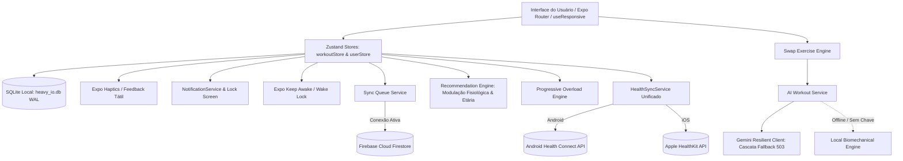

# heavy.io — Arquitetura de Software & Engenharia

Visão técnica aprofundada da arquitetura do aplicativo **heavy.io**, seus padrões de projeto, fluxo de dados local-first e integrações nativas.

---

## 1. Visão Geral & Filosofia de Arquitetura

O **heavy.io** é arquitetado como um sistema **Local-First & Offline-First**:
- **Toda e qualquer mutação de treino** ocorre primeiramente no banco de dados SQLite local embarcado (`heavy_io.db`) com transações síncronas de alta velocidade e journaling WAL (*Write-Ahead Logging*).
- Nenhuma operação essencial (iniciar treino, marcar repetições, rodar cronômetro, salvar PR) depende de conectividade com a internet.
- A sincronização com a nuvem (Firebase Firestore) opera de forma assíncrona por meio de uma **Fila de Sincronização Persistente (`sync_queue`)** com retry exponencial.

---

## 2. Tecnologias & Versões do Core

| Componente | Tecnologia | Versão | Propósito |
| :--- | :--- | :--- | :--- |
| **Runtime** | React Native / Expo SDK | `~57.0.21` | Core mobile nativo para iOS & Android |
| **Linguagem** | TypeScript | `~6.0.3` | Tipagem estrita ponta a ponta (`strict: true`) |
| **Engine JS** | React | `19.2.3` | Renderização moderna com React Compiler |
| **Banco Local** | `expo-sqlite` (com `wa-sqlite`) | `~57.0.2` | SQLite nativo no device e WASM na Web |
| **Estado Global**| `zustand` | `^5.0.15` | State management leve sem boilerplate |
| **Navegação** | `expo-router` | `~57.0.20` | Roteamento baseado em arquivos com abas |
| **IA Generativa** | Google Gemini API | `v1beta` | Análise biomecânica e substituição contextual de exercícios |
| **Saúde (Android)** | `react-native-health-connect` | `^4.1.3` | Sincronização com ecossistema Android Health |
| **Saúde (iOS)** | Apple HealthKit Bridge | Nativo | Sincronização com Apple Health |
| **Notificações** | `expo-notifications` | `~57.0.17` | Notificações contínuas e ações na tela de bloqueio |
| **Tela Ativa** | `expo-keep-awake` | `~57.0.2` | Prevenção de desligamento de tela durante séries |
| **Layout Adaptativo**| `useResponsive` | Custom | Layout reativo para dobráveis (Foldables) e tablets |
| **Ícones** | `lucide-react-native` | `^1.43.0` | Ícones minimalistas de precisão técnica |

---

## 3. Fluxo de Execução do Treino & Crash Recovery

### 3.1 Ciclo de Vida da Sessão Ativa
1. **Início da Sessão**: O atleta inicia um treino livre ou seleciona uma rotina programada. O método `startWorkout()` ou `startWorkoutFromRoutine()` gera um UUID, registra a hora inicial (`startTime`) e ativa o Wake Lock (`activateKeepAwakeAsync()`).
2. **Registro de Séries & Herança de Cargas**:
   - Cada série utiliza placeholders neutros (`0` kg e `8` reps) ou recupera automaticamente o peso e repetições realizados na sessão mais recente daquele exercício.
   - Cada alteração de peso, repetição ou marcação de conclusão dispara:
     - Cálculo instantâneo de tonelagem ($\sum \text{peso} \times \text{reps}$).
     - Verificação de Recorde Pessoal (PR) comparando com a fórmula de Epley:
       $$\text{1RM Estimado} = \text{Peso} \times \left(1 + \frac{\text{Reps}}{30}\right)$$
     - Disparo do cronômetro de descanso configurado para o exercício (ou preferência do usuário).
     - Notificação persistente no lock screen (`Ongoing Notification`) com botões `+30s` e `Pular`.
3. **Persistência Periódica & Crash Recovery**:
   - A cada alteração e a cada 5 segundos de treino, o estado completo da sessão ativa é persistido no `AsyncStorage` através da chave `@heavy_active_session`.
   - Se o sistema operacional encerrar o app por baixa memória durante o descanso, o hook de inicialização do dashboard (`index.tsx`) detecta a sessão interrompida e renderiza o card de **Recuperação de Sessão (Crash Recovery)**:
     - O atleta pode tocar em **"Retomar Treino"** para hidratar a store e continuar de onde parou com cronômetro corrigido, ou **"Descartar"**.
4. **Finalização do Treino**:
   - `finishWorkout()` executa transação no SQLite:
     - Grava a sessão em `workout_sessions`.
     - Grava os exercícios em `workout_session_exercises`.
     - Grava novos recordes em `personal_records`.
     - Enfileira payload em `sync_queue`.
   - Dispara exportação automática de treino de força e calorias gastas para a **Camada Unificada de Saúde (Health Connect / Apple Health)**.
   - Abre o modal comemorativo de fim de treino com resumo de duração, tonelagem, novos PRs e compartilhamento nativo.

---

## 4. Camada de Notificações em Segundo Plano & Lock Screen

O serviço [`notificationService.ts`](file:///c:/Users/Eduardo/Desktop/exemplo/heavy.io/src/services/notificationService.ts) implementa:

1. **Canal Android de Máxima Prioridade (`AndroidImportance.MAX`)**:
   - Visibilidade pública na tela de bloqueio (`AndroidNotificationVisibility.PUBLIC`).
   - Categoria interativa `REST_TIMER_CATEGORY` contendo as ações nativas:
     - `REST_ACTION_ADD_30` (Adiciona $+30\text{s}$ sem desbloquear o aparelho).
     - `REST_ACTION_SKIP` (Pula o descanso imediatamente).
2. **Notificação Fixa Contínua (Ongoing / Sticky)**:
   - Identificador único `heavy_ongoing_rest_timer` com `sticky: true`, impedindo descarte acidental por swipe.
3. **Ponte de Live Activity / Dynamic Island ([`liveActivityService.ts`](file:///c:/Users/Eduardo/Desktop/exemplo/heavy.io/src/services/liveActivityService.ts))**:
   - Contratos de estado para ActivityKit no iOS com `exerciseName`, `totalDurationSeconds` e `targetEndTime`.
4. **Interceptação Global no Boot ([`app/_layout.tsx`](file:///c:/Users/Eduardo/Desktop/exemplo/heavy.io/app/_layout.tsx))**:
   - Listener de respostas de notificação para processar ações de segundo plano de forma transparente.

---

## 5. Camada de Sincronização em Segundo Plano (Sync Queue)

O serviço [`syncQueueService.ts`](file:///c:/Users/Eduardo/Desktop/exemplo/heavy.io/src/services/syncQueueService.ts) gerencia o envio confiável para a nuvem:

1. **Enfileiramento Local**: Sempre que uma sessão é concluída, um registro é inserido na tabela `sync_queue` com status `'pending'`.
2. **Processamento Inteligente**:
   - Monitora o estado da rede via `@react-native-community/netinfo`.
   - Se online e usuário autenticado no Firebase, despacha o payload via lote para a coleção Firestore `users/{uid}/workout_sessions`.
   - Em caso de falha, incrementa `retry_count` com recuo exponencial (*exponential backoff*).
   - Ao confirmar o upload, marca `status = 'synced'` e registra `synced_at`.

---

## 6. Motor Algorítmico de Recomendação & Modulação Fisiológica

O motor [`recommendationEngine.ts`](file:///c:/Users/Eduardo/Desktop/exemplo/heavy.io/src/recommendationEngine.ts) analisa parâmetros antropométricos e fisiológicos coletados no Onboarding:
- Frequência semanal (2x a 6x).
- Tempo disponível por treino (30-45 min a 60-90 min).
- Objetivo primário (Hipertrofia, Força Máxima, Recomposição, Resistência Muscular).
- Nível de experiência (Iniciante, Intermediário, Avançado).
- Idade do atleta e sexo biológico.
- Equipamentos disponíveis (Academia Comercial, Halteres/Barra em Casa, Calistenia).
- Restrições articulares (Ombros, Lombar, Joelhos, Pulsos).

### 6.1 Modulação Fisiológica por Faixa Etária (Masters & Longevidade)
O motor ajusta matematicamente o estímulo para equilibrar síntese proteica e preservação de tecido conjuntivo:
- **Atletas Masters ($\ge 50$ anos)**:
  - **Teto de Volume Efetivo**: Limitação de séries para evitar *junk volume* e inflamação crônica em tendões/cartilagens.
  - **Descanso Estendido**: Acréscimo automático de $+15\text{s}$ a $+25\text{s}$ entre séries para permitir regeneração completa de fosfagênios (PCr) e recuperação cardiovascular.
  - **RIR Seguro**: RIR mínimo de 2 em compostos primários para mitigar risco de colapso técnico sob fadiga.
  - **Preservação de Coluna e Articulações**: Bônus de pontuação para trajetórias guiadas e apoio torácico (`chest_supported_dumbbell_row`, `hack_squat_machine`, `seated_cable_row`, `machine_chest_press`). Penalização rígida de torques de cisalhamento axial desnecessários (`good_morning_barbell`, `barbell_bent_over_row`, `t_bar_row_unsupported`).
- **Atletas 40–49 anos**:
  - Acréscimo gradual de $+5\text{s}$ de descanso e priorização de movimentos com alta relação estímulo-fadiga (SFR).
- **Diferenciação por Sexo Biológico**:
  - Aplicação de fator de recuperação de fosfagênios ($0.8\times$) para mulheres, refletindo menor acúmulo de fadiga periférica e recuperação mais rápida de PCr (Hunter, 2014).

---

## 7. Motor de IA Biomecânica & Cliente Gemini Resiliente

Implementado em [`aiWorkoutService.ts`](file:///c:/Users/Eduardo/Desktop/exemplo/heavy.io/src/services/aiWorkoutService.ts) e [`geminiClient.ts`](file:///c:/Users/Eduardo/Desktop/exemplo/heavy.io/src/services/geminiClient.ts):

### 7.1 Substituição Contextual de Exercícios por Motivo do Atleta
Quando um exercício precisa ser substituído, o atleta informa o motivo específico:
- **`equipment_unavailable` (Equipamento Ocupado/Quebrado)**: Prioriza alternativas com implementos livres (halteres) ou máquinas equivalentes que trabalhem a mesma mecânica.
- **`joint_pain_discomfort` (Dor ou Desconforto Articular)**: Filtra movimentos que causem estresse na articulação afetada, priorizando apoio torácico e ângulos confortáveis.
- **`fatigue_sfr` (Fadiga Excessiva / SFR Baixo)**: Sugere exercícios com alto *Stimulus-to-Fatigue Ratio*, substituindo pesos livres pesados por cabos e máquinas estáveis.
- **`muscle_focus_variation` (Variação de Estímulo)**: Seleciona variações com ênfase em curvas de resistência complementares (alongamento vs. encurtamento).
- **`time_constraint_machine` (Falta de Tempo)**: Sugere aparelhos de ajuste rápido sem montagem de anilhas.

### 7.2 Cascata de Fallback Inteligente contra Erro 503
O cliente Gemini implementa alta disponibilidade para mitigar picos de demanda da API:
1. **Tentativa em Cascata de Modelos**: `gemini-3.6-flash` $\to$ `gemini-3.5-flash` $\to$ `gemini-flash-latest` $\to$ `gemini-3.5-flash-lite` $\to$ `gemini-flash-lite-latest`.
2. **Backoff Exponencial**: Retentativas graduais em status 503 ou 429 com controle estrito de timeout por `AbortController`.
3. **Fallback Offline Autônomo**: Se não houver internet ou chave configurada, o motor recorre instantaneamente ao algoritmo de substituição determinístico local baseado no catálogo relacional do SQLite.

---

## 8. Motor de Sobrecarga Progressiva (Progressive Overload)

Localizado em [`progressiveOverloadEngine.ts`](file:///c:/Users/Eduardo/Desktop/exemplo/heavy.io/src/services/progressiveOverloadEngine.ts):
- Aplica o princípio da **Dupla Progressão (*Double Progression*)**:
  1. Progredir repetições dentro da faixa alvo (ex: 8 a 12 reps) mantendo a mesma carga.
  2. Ao atingir o teto da faixa em todas as séries com RIR adequado, elevar a carga (ex: $+2.5\text{kg}$ ou $+5\text{kg}$) e retornar à base da faixa.
- Detecção de platôs de força e recomendações de deload ou variação de estímulo.

---

## 9. Camada Unificada de Saúde (Apple Health & Google Health Connect)

O serviço unificado [`healthSyncService.ts`](file:///c:/Users/Eduardo/Desktop/exemplo/heavy.io/src/services/healthSyncService.ts) abstrai as diferenças entre as plataformas móveis:
- **Multiplataforma**: Comunica-se com **Google Health Connect** no Android e **Apple HealthKit** no iOS através da mesma interface (`UnifiedHealthStatus`).
- **Biometria Bidirecional**: Importação de peso e altura corporais reais.
- **Exportação de Força**: Gravação de sessões `STRENGTH_TRAINING` com tonelagem e cálculo de gasto calórico por equivalência metabólica (MET).
- **Métricas Cardíacas**: Captura de frequência cardíaca (BPM médio e pico) registradas por smartwatches (Apple Watch, Wear OS, Galaxy Watch) durante o treino para correlacionar intensidade e recuperação.

---

## 10. Suporte e Layout Adaptativo para Dobráveis & Telas Amplas

Implementado através do hook reativo [`useResponsive.ts`](file:///c:/Users/Eduardo/Desktop/exemplo/heavy.io/src/hooks/useResponsive.ts):
- **Detecção em Tempo Real de Dobra/Desdobra**:
  - `isFoldable`: Ativado em telas amplas ($\ge 600\text{dp}$), típico de dobráveis abertos (Samsung Galaxy Z Fold 6, Pixel 9 Pro Fold) e tablets.
  - `isNarrowCover`: Otimizado para telas externas estreitas ($< 380\text{dp}$).
- **Ergonomia e Legibilidade**:
  - `maxContentWidth` limitado a $840\text{dp}$ para evitar linhas de dados excessivamente esticadas.
  - `tabBarMaxWidth` limitado a $560\text{dp}$ centralizado, garantindo que os botões de navegação permaneçam ao alcance dos polegares.
  - Grid dinâmico de 2 colunas para catálogos de exercícios e rotinas em modo aberto.

