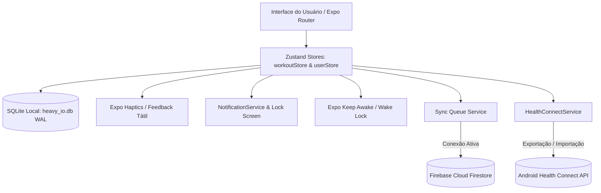

# heavy.io — Arquitetura de Software & Engenharia

Visão técnica aprofundada da arquitetura do aplicativo **heavy.io**, seus padrões de projeto, fluxo de dados local-first e integrações nativas.

---

## 1. Visão Geral & Filosofia de Arquitetura

O **heavy.io** é arquitetado como um sistema **Local-First & Offline-First**:
- **Toda e qualquer mutação de treino** ocorre primeiramente no banco de dados SQLite local embarcado (`heavy_io.db`) com transações síncronas de alta velocidade e journaling WAL (*Write-Ahead Logging*).
- Nenhuma operação essencial (iniciar treino, marcar repetições, rodar cronômetro, salvar PR) depende de conectividade com a internet.
- A sincronização com a nuvem (Firebase Firestore) opera de forma assíncrona por meio de uma **Fila de Sincronização Persistente (`sync_queue`)** com retry exponencial.

---

## 2. Tecnologias & Versões do Core

| Componente | Tecnologia | Versão | Propósito |
| :--- | :--- | :--- | :--- |
| **Runtime** | React Native / Expo SDK | `~57.0.21` | Core mobile nativo para iOS & Android |
| **Linguagem** | TypeScript | `~6.0.3` | Tipagem estrita ponta a ponta (`strict: true`) |
| **Engine JS** | React | `19.2.3` | Renderização moderna com React Compiler |
| **Banco Local** | `expo-sqlite` (com `wa-sqlite`) | `~57.0.2` | SQLite nativo no device e WASM na Web |
| **Estado Global**| `zustand` | `^5.0.15` | State management leve sem boilerplate |
| **Navegação** | `expo-router` | `~57.0.20` | Roteamento baseado em arquivos com abas |
| **Saúde** | `react-native-health-connect` | `^4.1.3` | Sincronização com ecossistema Android Health |
| **Notificações** | `expo-notifications` | `~57.0.17` | Notificações contínuas e ações na tela de bloqueio |
| **Tela Ativa** | `expo-keep-awake` | `~57.0.2` | Prevenção de desligamento de tela durante séries |
| **Ícones** | `lucide-react-native` | `^1.43.0` | Ícones minimalistas de precisão técnica |

---

## 3. Fluxo de Execução do Treino & Crash Recovery

### 3.1 Ciclo de Vida da Sessão Ativa
1. **Início da Sessão**: O atleta inicia um treino livre ou seleciona uma rotina programada. O método `startWorkout()` ou `startWorkoutFromRoutine()` gera um UUID, registra a hora inicial (`startTime`) e ativa o Wake Lock (`activateKeepAwakeAsync()`).
2. **Registro de Séries**: Cada alteração de peso, repetição ou marcação de conclusão dispara:
   - Cálculo instantâneo de tonelagem ($\sum \text{peso} \times \text{reps}$).
   - Verificação de Recorde Pessoal (PR) comparando com a fórmula de Epley:
     $$\text{1RM Estimado} = \text{Peso} \times \left(1 + \frac{\text{Reps}}{30}\right)$$
   - Disparo do cronômetro de descanso configurado para o exercício (ou preferência do usuário).
   - Notificação persistente no lock screen (`Ongoing Notification`) com botões `+30s` e `Pular`.
3. **Persistência Periódica & Crash Recovery**:
   - A cada alteração e a cada 5 segundos de treino, o estado completo da sessão ativa é persistido no `AsyncStorage` através da chave `@heavy_active_session`.
   - Se o sistema operacional encerrar o app por baixa memória durante o descanso, o hook de inicialização do dashboard (`index.tsx`) detecta a sessão interrompida e renderiza o card de **Recuperação de Sessão (Crash Recovery)**:
     - O atleta pode tocar em **"Retomar Treino"** para hidratar a store e continuar de onde parou com cronômetro corrigido, ou **"Descartar"**.
4. **Finalização do Treino**:
   - `finishWorkout()` executa transação no SQLite:
     - Grava a sessão em `workout_sessions`.
     - Grava os exercícios em `workout_session_exercises`.
     - Grava novos recordes em `personal_records`.
     - Enfileira payload em `sync_queue`.
   - Dispara exportação automática de treino de força e calorias gastas para o **Health Connect**.
   - Abre o modal comemorativo de fim de treino com resumo de duração, tonelagem, novos PRs e compartilhamento nativo.

---

## 4. Camada de Notificações em Segundo Plano & Lock Screen

O serviço [`notificationService.ts`](file:///c:/Users/Eduardo/Desktop/exemplo/heavy.io/src/services/notificationService.ts) implementa:

1. **Canal Android de Máxima Prioridade (`AndroidImportance.MAX`)**:
   - Visibilidade pública na tela de bloqueio (`AndroidNotificationVisibility.PUBLIC`).
   - Categoria interativa `REST_TIMER_CATEGORY` contendo as ações nativas:
     - `REST_ACTION_ADD_30` (Adiciona $+30\text{s}$ sem desbloquear o aparelho).
     - `REST_ACTION_SKIP` (Pula o descanso imediatamente).
2. **Notificação Fixa Contínua (Ongoing / Sticky)**:
   - Identificador único `heavy_ongoing_rest_timer` com `sticky: true`, impedindo descarte acidental por swipe.
3. **Ponte de Live Activity / Dynamic Island ([`liveActivityService.ts`](file:///c:/Users/Eduardo/Desktop/exemplo/heavy.io/src/services/liveActivityService.ts))**:
   - Contratos de estado para ActivityKit no iOS com `exerciseName`, `totalDurationSeconds` e `targetEndTime`.
4. **Interceptação Global no Boot ([`app/_layout.tsx`](file:///c:/Users/Eduardo/Desktop/exemplo/heavy.io/app/_layout.tsx))**:
   - Listener de respostas de notificação para processar ações de segundo plano de forma transparente.

---

## 5. Camada de Sincronização em Segundo Plano (Sync Queue)

O serviço [`syncQueueService.ts`](file:///c:/Users/Eduardo/Desktop/exemplo/heavy.io/src/services/syncQueueService.ts) gerencia o envio confiável para a nuvem:

1. **Enfileiramento Local**: Sempre que uma sessão é concluída, um registro é inserido na tabela `sync_queue` com status `'pending'`.
2. **Processamento Inteligente**:
   - Monitora o estado da rede via `@react-native-community/netinfo`.
   - Se online e usuário autenticado no Firebase, despacha o payload via lote para a coleção Firestore `users/{uid}/workout_sessions`.
   - Em caso de falha, incrementa `retry_count` com recuo exponencial (*exponential backoff*).
   - Ao confirmar o upload, marca `status = 'synced'` e registra `synced_at`.

---

## 6. Motor Algorítmico de Recomendação de Treino

O motor [`recommendationEngine.ts`](file:///c:/Users/Eduardo/Desktop/exemplo/heavy.io/src/recommendationEngine.ts) analisa 7 parâmetros do atleta coletados no Onboarding:
- Frequência semanal (2x a 6x).
- Tempo disponível por treino (45 a 90 min).
- Objetivo primário (Hipertrofia, Força Máxima, Recomposição, Resistência Muscular).
- Nível de experiência (Iniciante, Intermediário, Avançado).
- Equipamentos disponíveis (Academia Comercial, Halteres/Barra em Casa, Calistenia).
- Restrições articulares (Ombros, Lombar, Joelhos, Pulsos).

Com base nesses dados, calcula o split ideal (Full Body, Upper/Lower, PPL, Arnold Split), filtra exercícios que não sobrecarreguem articulações comprometidas e programa faixas de repetições e tempos de descanso ideais.
