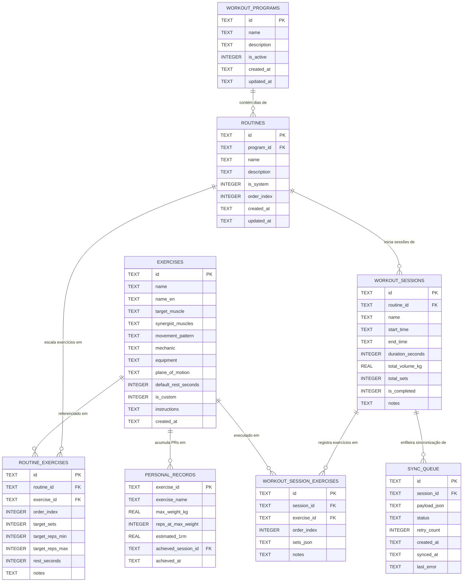

# heavy.io — Esquema de Banco de Dados & Modelos de Dados (SQLite)

Documentação técnica completa do modelo relacional embarcado no SQLite (`heavy_io.db`) utilizado pelo **heavy.io**.

---

## 1. Diagrama Entidade-Relacionamento (ERD)



---

## 2. Detalhamento das Tabelas

### 2.1 `workout_programs` (Fichas de Treino)
Armazena as divisões e programas de treino (ex.: "Ciclo de Força 3x", "Treino de Férias", "PPL Clássico").
- `id` (`TEXT PRIMARY KEY`): Identificador único no padrão `prog_<timestamp>_<hash>`.
- `name` (`TEXT NOT NULL`): Nome visível da ficha.
- `description` (`TEXT`): Descrição opcional ou objetivo da periodização.
- `is_active` (`INTEGER NOT NULL DEFAULT 0`): Flag indicando se esta é a ficha ativa orientando o ciclo diário do app (`1` = ativa, `0` = inativa).
- `created_at` / `updated_at` (`TEXT NOT NULL`): Timestamps em formato ISO 8601 UTC.

### 2.2 `routines` (Dias / Sessões da Ficha)
Representa os dias de treino pertencentes a um programa (ex.: "Treino A: Empurrar", "Treino B: Puxar").
- `id` (`TEXT PRIMARY KEY`): ID da rotina.
- `program_id` (`TEXT FK`): Chave estrangeira referenciando `workout_programs(id)` com `ON DELETE CASCADE`.
- `name` (`TEXT NOT NULL`): Nome da sessão.
- `description` (`TEXT`): Foco biomecânico da sessão.
- `is_system` (`INTEGER NOT NULL DEFAULT 0`): Flag indicando se é rotina de fábrica imutável (`1`) ou customizada pelo usuário (`0`).
- `order_index` (`INTEGER NOT NULL DEFAULT 0`): Ordem da sessão dentro da ficha (Dia A = 0, Dia B = 1, etc.).

### 2.3 `routine_exercises` (Exercícios Escalados no Dia)
Mapeia os exercícios pertencentes a cada dia da rotina com parâmetros de treino alvo.
- `id` (`TEXT PRIMARY KEY`): Identificador único do item.
- `routine_id` (`TEXT FK`): Referência a `routines(id)` com `ON DELETE CASCADE`.
- `exercise_id` (`TEXT FK`): Referência ao catálogo de `exercises(id)` com `ON DELETE CASCADE`.
- `order_index` (`INTEGER NOT NULL DEFAULT 0`): Ordem de execução do exercício no treino (utilizado para reordenação ▲/▼).
- `target_sets` (`INTEGER NOT NULL DEFAULT 3`): Quantidade planejada de séries.
- `target_reps_min` (`INTEGER NOT NULL DEFAULT 8`): Limite inferior da faixa de repetições.
- `target_reps_max` (`INTEGER NOT NULL DEFAULT 12`): Limite superior da faixa de repetições.
- `rest_seconds` (`INTEGER NOT NULL DEFAULT 90`): Tempo programado de descanso entre séries.
- `notes` (`TEXT`): Anotações técnicas e configurações de máquina.

### 2.4 `exercises` (Biblioteca Biomecânica de Exercícios)
Catálogo oficial do sistema e exercícios criados pelos próprios atletas.
- `id` (`TEXT PRIMARY KEY`): Identificador do exercício (ex.: `barbell_bench_press`, ou `custom_<timestamp>_<hash>`).
- `name` (`TEXT NOT NULL`): Nome em português.
- `name_en` (`TEXT`): Nome original internacional em inglês.
- `target_muscle` (`TEXT NOT NULL`): Grupo muscular primário (peito, costas, quadriceps, etc.).
- `synergist_muscles` (`TEXT`): Array JSON de músculos sinergistas secundários.
- `movement_pattern` (`TEXT NOT NULL`): Padrão motor funcional (horizontal_push, vertical_pull, squat, hinge, etc.).
- `mechanic` (`TEXT NOT NULL`): Tipo de articulação (`compound` para multiarticular ou `isolation` para uniarticular).
- `equipment` (`TEXT NOT NULL`): Implemento (barbell, dumbbell, cable, machine, bodyweight, smith, kettlebell).
- `plane_of_motion` (`TEXT`): Plano de movimento anatômico (sagittal, frontal, transverse, multiplanar).
- `default_rest_seconds` (`INTEGER NOT NULL DEFAULT 90`): Descanso sugerido por padrão.
- `is_custom` (`INTEGER NOT NULL DEFAULT 0`): Flag que protege exercícios de fábrica (`0`) contra edição/exclusão e identifica criações do atleta (`1`).
- `instructions` (`TEXT`): Dicas e instruções de execução.

### 2.5 `workout_sessions` (Histórico de Sessões Concluídas)
Registro detalhado de cada treino finalizado pelo atleta.
- `id` (`TEXT PRIMARY KEY`): ID único da sessão (`ws_<timestamp>_<hash>`).
- `routine_id` (`TEXT FK`): Referência opcional à rotina que originou o treino.
- `name` (`TEXT NOT NULL`): Nome do treino realizado.
- `start_time` (`TEXT NOT NULL`): Timestamp ISO do início.
- `end_time` (`TEXT`): Timestamp ISO da conclusão.
- `duration_seconds` (`INTEGER NOT NULL DEFAULT 0`): Duração cronometrada da sessão.
- `total_volume_kg` (`REAL NOT NULL DEFAULT 0`): Tonelagem total levantada ($\sum \text{peso} \times \text{reps}$).
- `total_sets` (`INTEGER NOT NULL DEFAULT 0`): Total de séries concluídas.
- `is_completed` (`INTEGER NOT NULL DEFAULT 0`): Flag de conclusão.
- `notes` (`TEXT`): Observações gerais pós-treino.

### 2.6 `workout_session_exercises` (Exercícios Executados na Sessão)
Armazena a relação de exercícios executados na sessão com todas as séries detalhadas em formato JSON.
- `id` (`TEXT PRIMARY KEY`): Identificador único.
- `session_id` (`TEXT FK`): Referência a `workout_sessions(id)`.
- `exercise_id` (`TEXT FK`): Referência ao exercício.
- `order_index` (`INTEGER NOT NULL DEFAULT 0`): Posição em que foi realizado.
- `sets_json` (`TEXT NOT NULL`): Array JSON de séries (`WorkoutSet[]`), contendo `setNumber`, `type` (warmup, normal, drop, failure), `weightKg`, `reps`, `rpe`, `rir`, `completed` e `completedAt`.

### 2.7 `personal_records` (Hall de Recordes Pessoais)
Registra o ápice de performance para cada movimento registrado no app.
- `exercise_id` (`TEXT PRIMARY KEY`): Identificador do exercício.
- `exercise_name` (`TEXT NOT NULL`): Nome do exercício.
- `max_weight_kg` (`REAL NOT NULL`): Maior carga absoluta levantada em série concluída.
- `reps_at_max_weight` (`INTEGER NOT NULL`): Repetições na série de maior carga.
- `estimated_1rm` (`REAL NOT NULL`): Carga máxima estimada calculada por Epley.
- `achieved_session_id` (`TEXT`): Sessão na qual o recorde foi conquistado.
- `achieved_at` (`TEXT NOT NULL`): Timestamp do recorde.

### 2.8 `sync_queue` (Fila de Sincronização em Nuvem)
Garante a integridade do modelo Local-First com reenvio assíncrono.
- `id` (`TEXT PRIMARY KEY`): ID da entrada de sincronização.
- `session_id` (`TEXT NOT NULL`): ID da sessão a ser enviada.
- `payload_json` (`TEXT NOT NULL`): Serialização completa dos dados da sessão.
- `status` (`TEXT NOT NULL DEFAULT 'pending'`): `'pending'`, `'synced'` ou `'failed'`.
- `retry_count` (`INTEGER NOT NULL DEFAULT 0`): Contador de tentativas de reenvio.
- `created_at` (`TEXT NOT NULL`): Data de enfileiramento.
- `synced_at` (`TEXT`): Data em que o Firestore confirmou o recebimento.
- `last_error` (`TEXT`): Mensagem de erro capturada caso a requisição falhe.

---

## 3. Índices de Otimização

Para garantir respostas instantâneas (abaixo de 5ms) em dispositivos móveis mesmo com anos de treinos acumulados:

```sql
CREATE INDEX IF NOT EXISTS idx_exercises_target_muscle ON exercises(target_muscle);
CREATE INDEX IF NOT EXISTS idx_exercises_movement_pattern ON exercises(movement_pattern);
CREATE INDEX IF NOT EXISTS idx_exercises_name ON exercises(name);
CREATE INDEX IF NOT EXISTS idx_workout_programs_active ON workout_programs(is_active);
CREATE INDEX IF NOT EXISTS idx_routines_program ON routines(program_id);
CREATE INDEX IF NOT EXISTS idx_routine_exercises_routine ON routine_exercises(routine_id);
CREATE INDEX IF NOT EXISTS idx_workout_sessions_start_time ON workout_sessions(start_time DESC);
CREATE INDEX IF NOT EXISTS idx_workout_session_exercises_session ON workout_session_exercises(session_id);
CREATE INDEX IF NOT EXISTS idx_sync_queue_status ON sync_queue(status, retry_count);
```
